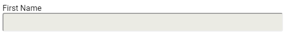

# Text Fields

### Introduction

* An input field must have associated `<label>` element. To do this, add the `for` attribute to the`<label>` element. The value of the `for` attribute must be the same as the value for the `<input>` element's `id` attribute value. 
* When the input field fails to validate, an associated error message should be shown. To do this, add the `aria-describedby` attribute to the `<input>` element. The value of the `aria-describedby` attribute must be the same as the value for the `id` of the element that shows the error message \(typically a `<span>` element\). 

### Part One: Considering Markup

_**First and foremost:**_ These samples have been simplified to focus on accessibility. Simply copying and pasting these code samples will not produce a complete result. 

#### Input Types

The `type` attribute value is the most important attribute for the `<input>` element. While it is `text` by default, here are some other common input types:

* email
* file
* number
* password
* search
* tel \(telephone\)
* url

Other valid type values are `checkbox` and `radiobutton` , but covered in separate topics in this guide. There are other input types that are still valid but are no longer recommended for use, as they have been replaced with better support \(i.e., `input type="submit"` should now be `button type="submit"`\). 


Fun Alert! See [https://codepen.io/melsumner/pen/ExYwqxZ](https://codepen.io/melsumner/pen/ExYwqxZ) for valid native HTML input types and some native client-side form validation in action- it may contain a few surprises!


#### Text Input with a label

```markup
<label for="input-firstName">First Name</label>
<input type="text" id="input-firstName" name="firstName" />
```

#### Input Attributes

Some attributes are required to make the `<input>` element work properly. The `name` and `value` attributes both contain data that is submitted to the server when the form submits. It can also be useful in some cases to pre-fill the `value` attribute. 

There are also useful attributes available for use with the `<input>` element that developers should be aware of, as this prevents unnecessary JavaScript. Some of these attributes provide useful client-side form validation. 


Warning: client-side validation should _never_ be considered an appropriate substitution for server-side validation. Client-side validation can quickly and easily provide user feedback. Server-side validation is more intrusive and dependent on factors that can affect performance, and as such it is recommended to use both to obtain balance. Server-side validation should _always_ be used to protect the application against those with malicious intent. 


`required`   
The presence of the `required` attribute will indicate that the input must be filled out by the user. It should be noted that only the attribute is required. Removing the attribute will indicate that it is not required. Example: 

```markup
<label for="firstName-input">First Name</label>
<input type="text" id="firstName-input" name="firstName" required />
```

`disabled`   
The presence of the `disabled` attribute will prevent the user from interacting with this element, and the `value` of this field will not be submitted to the server with the rest of the form data. This is useful in cases where it has been determined that the specific end user does not meet the criteria to fill out this specific form field. Disabled elements are also not required to pass [color contrast standards](https://www.w3.org/WAI/WCAG21/quickref/?showtechniques=143#contrast-minimum) as related to WCAG success criteria. Finally, it should be noted that only the presence of the attribute is required. 

```markup
<label for="firstName-input">First Name</label>
<input type="text" id="firstName-input" name="firstName" disabled />
```



It should be noted that browsers will apply default styles to input fields marked as `disabled`; however this can be overridden with custom CSS if desired.

`readonly`   
The presence of the `readonly` attribute will allow the user to view the current value, but will not allow the user to change it. This is different from `disabled` in that the value for the input field marked with `readonly` will be sent to the server when the form is submitted. Again, it should be noted that only the presence of the attribute is required. Example: 

```markup
<label for="firstName-input">First Name</label>
<input type="text" id="firstName-input" name="firstName" value="Zoey" readonly />
```


It should be noted that browsers will apply default styles to input fields marked as `readonly`; however this can be overridden with custom CSS if desired.

`autocomplete`   
Input fields are set to `autocomplete="true"` by default. This will allow some browsers \(that provide the option\) to automatically fill in information saved by the user to the browser itself. In instances where this is not desired behavior, setting `autocomplete="false"` will turn this option off. 

It is an elevated experience for users with assistive technology to include this attribute in form fields, especially where the type of questions being asked in a form are atypical of the type of autocomplete data \(such as name and address\) that a user's browser may have stored. Example: 

```markup
<label for="camping-preference">Where is your favorite place to camp?</label>
<input id="camping-preference" type="text" name="campingPreference" autocomplete="false" />
```

`pattern`   
Setting the pattern attribute value will provide client-side form validation for the user. The `pattern` attribute expects a Regular Expression as its value. Example:

```markup
<label for="weather-preference">Do you prefer sunny weather or cloudy weather?</label>
<input type="text" pattern="[Ss]unny|[Cc]loudy" id="weather-preference" />
```

Using the `:invalid` and `:valid` pseudo selectors in CSS can indicate that the element is invalid: 



Note: the `email` and `url` input types do not require a `pattern` attribute, because they already provide their own form of pattern validation. Additionally, `pattern` is ignored if the input type is `number` AND the browser supports the type. For browsers that do not support the `number` type, the `pattern` attribute can be used to provide a graceful fallback. 


`min-length` and `max-length`   
When it is useful to control the number of characters put into the field, `min-length` and `max-length` attributes can be used. Some traditional databases have a maximum character length that they can accept, so it is prudent to be aware of the limitations of where the form data is heading. 

It is also appropriate to be aware that non-traditional data may exist, and plan for those use cases. For more reading on this subject, search for "_names that break websites_", or read [People's Names that Break Websites](https://css-tricks.com/peoples-names-break-websites/). 

`placeholder`   
Sometimes it is useful to show the user what kind of formatting is expected. In these cases, the `placeholder` attribute can be useful. Example: 

```markup
<label for="firstName-input">First Name</label>
<input id="firstName-input" type="text" name="firstName" placeholder="Zoey McEmber" />
```



Warning! It is not acceptable to use a `placeholder` instead of an associated `<label>` element. Machine-readable code requires a `<label>` element to be associated with each input field. See the styling sub-section for ideas on styling. 


There are some other attributes that exist but are not commonly used today, such as `size`  and `width` as these things are more appropriately managed with CSS.

#### Input with associated error message

If additional guidance is desired, an error message that is associated with the input field can be added.   
This is what the simplified markup for an input with an associated error message could look like: 

```markup
<label for="input-email">Email</label> 
<input type="email" id="input-firstName" aria-describedby="email__error-message" 
aria-invalid="true" /> 
<span id="email__error-message" role="alert">
  Please enter a valid email address.
</span> 
```

Note the `aria-describedby` attribute on the `input` field, whose value matches the `id` of the element that contains the error message.

### Part Two: Ember Component\(s\)

First, the appropriate requirements should be gathered 

Next, the component should be generated:

```bash
ember generate component input-text -gc
```

This will create three files and put them in the correct location: 

* app/components/input-text.hbs
* app/components/input-text.js
* tests/integration/components/input-text-test.js

In **app/components/input-text.hbs**, the component markup can be set up and the places where dynamic functionality is needed can be indicated. 

So this markup: 

```markup
<div class="form-group">
  <label for="input-id">Label Text</label>
  <input 
    id="inputId" 
    name="input-name" 
    type="text" 
  />
</div>
```

Becomes this component template: 

```markup
<div class="form-group">
  <label for={{this.inputId}}>{{@inputLabelText}}</label>
  <input 
    id={{this.inputId}} 
    name={{@inputName}} 
    type="text" 
  />
</div>
```

In **app/components/input-text.js**, the input `id` will need to be generated so the label element can access it. While there are a few different ways to accomplish this, the existing `guidFor` function will serve nicely: 

```javascript
import Component from '@glimmer/component';
import { guidFor } from '@ember/object/internals';

export default class InputTextComponent extends Component {
  inputId = 'textInput-' + guidFor(this); 
}
```

Then, the component can be used in the view or page template: 

```markup
<InputText @inputLabelText="First Name" @inputName="firstName" />
```

#### Considering Attributes

Any form input planning should include considerations for which attributes should be supported. At the bare minimum, `required`, `disabled`, and `readonly` should be considered. 

Updated app/components/input-text.hbs to include these attributes:

```markup
<div class="form-group">
  <label for={{this.inputId}}>{{@inputLabelText}}</label>
  <input 
    id={{this.inputId}} 
    name={{@inputName}} 
    type="text" 
    disabled={{@isDisabled}}
    required={{@isRequired}}
    readonly={{@isReadonly}}
  />
</div>
```

Then they can be added or removed from the view/page template when the component is used. For example, if the disabled state was desired for an input field:

```markup
<InputText @inputLabelText="First Name" @inputName="firstName" @isDisabled="true" />
```

Note that if the attribute needs a false state, it cannot merely change to `@isDisabled="false"` \(that will still rendered the `disabled` attribute\) - it must be removed completely: 

```markup
<InputText @inputLabelText="First Name" @inputName="firstName" />
```

In these Ember Component examples, the components have been closely scoped for a specific type of text input and closely related use cases. Further customization could be desired, so it is recommended to consider the balance of use cases. By providing separate components for different input types, it can lower the developer's cognitive burden as there will be fewer options to remember within one specific component. 

On the other hand, some teams may find it more useful to have a "kitchen sink" style of input component, that accepts many different types. It is strongly recommended to have a team discussion in order to determine which is the right approach for the specific project. 

### References

* [https://developer.mozilla.org/en-US/docs/Web/HTML/Element/label](https://developer.mozilla.org/en-US/docs/Web/HTML/Element/label)
* [https://developer.mozilla.org/en-US/docs/Web/HTML/Element/input](https://developer.mozilla.org/en-US/docs/Web/HTML/Element/input)
* [https://api.emberjs.com/ember/release/functions/@ember%2Fobject%2Finternals/guidFor](https://api.emberjs.com/ember/release/functions/@ember%2Fobject%2Finternals/guidFor)


Feedback is welcome! Visit the [GitHub repository for this project](https://github.com/MelSumner/ember-component-patterns) to raise an issue or submit a PR.


